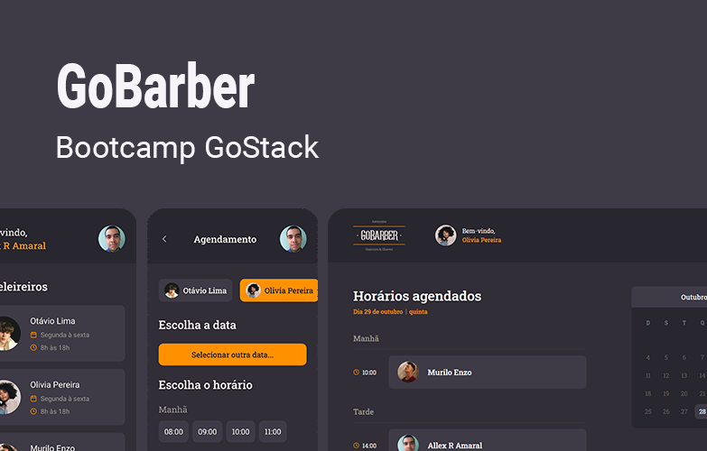
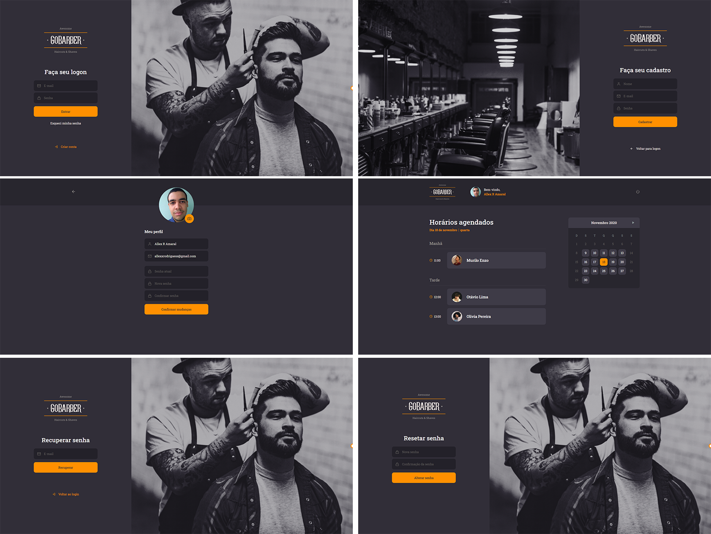

# GoBarber Web

  

------

GoBarber é uma plataforma para agendamento de serviços em barbearias. Desenvolvido durante o [Bootcamp GoStack](https://pages.rocketseat.com.br/gostack) 2020 @ [Rocketseat](https://rocketseat.com.br/)

  

## Funcionalidades

- Visualização dos agendamentos do barbeiro por dia;

- Fluxo básico de cadastro de usuário e acesso a conta.

## Ambiente de desenvolvimento

- Após clonar o repositório, instale as dependências do projeto rodando o comando `yarn`;

- Clone também o repositório do [backend do GoBarber](https://github.com/FusRoDah061/gostack-gobarber-backend) e deixe-o em execução;

- Crie um arquivo `.env` e configure o valor da chave `REACT_APP_API_URL` apontando para o backend do passo anterior.

- Para executar a aplicação, use o comando `yarn start`. Acessa-a em [http://localhost:3000](http://localhost:3000)

## Contribuindo

Após realizar suas alterações no código, abra uma pull-request para a branch master. Assim que for aprovada e mergeada, será gerado um novo deploy na [Netlify](https://www.netlify.com/).
